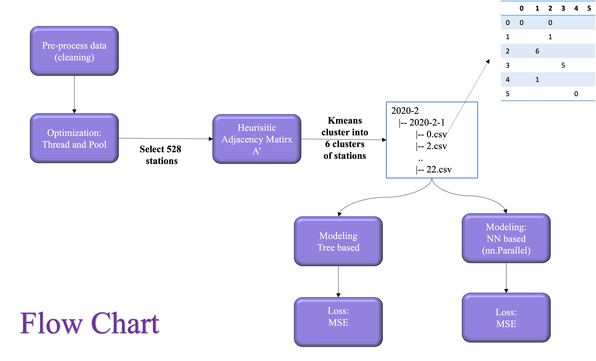

# Citibike-Analysis
## Code Documentations
```
preprocess/
   --
   -- 
   --
Model/
  - baseline.ipynb: code for baseline tree
  - RNN/ 
     -- model.py: GCN, RNN, CitiBike_Model
     -- dataset.py: Citibike dataset
     -- data_organize.py: organize data from 1 year csv into month/day/12 csvs

```

## Project Flowchart


